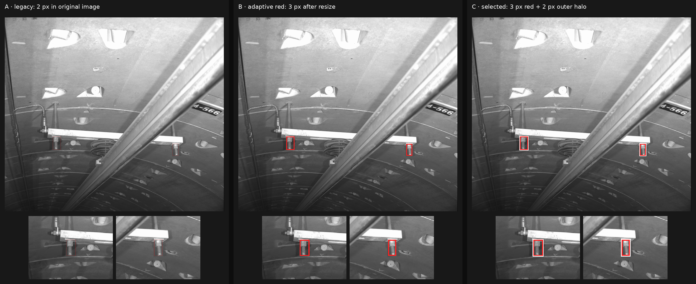

# Dynamic-resolution Reference Box rendering

This throwaway prototype compares three ways to render Reference Boxes at the agreed
640-token-per-image cap. Run it with a representative source image:

```bash
make prototype-reference-boxes IMAGE=/path/to/reference.jpg
```

The output is written to `outputs/reference_box_rendering.png`. The checked-in comparison uses
a 5312×4736 industrial reference image and the Qwen3-VL Processor's 832×736 resize plan (598
visual tokens).



## Decision

Use variant C: resize the EXIF-corrected Reference Image according to the adapter-owned Qwen3-VL
resize plan, then draw each Reference Box with a canonical `#ff2020` inner stroke and a white
halo outside the annotated boundary. Stroke widths are defined in processed-image pixels:

- inner red stroke: `clamp(round(shortest_processed_side / 256), 2, 4)` pixels;
- white halo: two pixels extending outward, so it does not cover the Reference Instance;
- target images are never decorated;
- rendering preserves aspect ratio and never changes Detection Protocol coordinates;
- all boxes in one Reference Image use the same style, and overlapping boxes remain independent.

At 832×736 this gives a 3 px red stroke plus a 2 px outward halo. The fixed
2 px source-image stroke becomes about 0.3 px and disappears after downsampling. Solid red is
visible on most backgrounds, while the white halo makes its boundary stable over dark and
low-contrast regions.

This prototype establishes visual behavior only. The production Adapter and preprocessing
contract will own exact resize-plan calculation, input validation, and tensor preparation.
